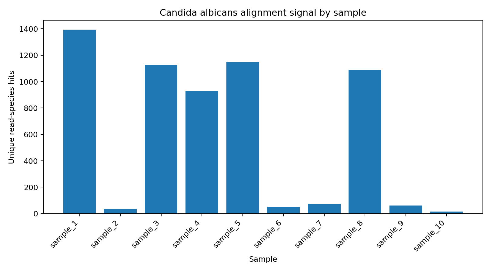
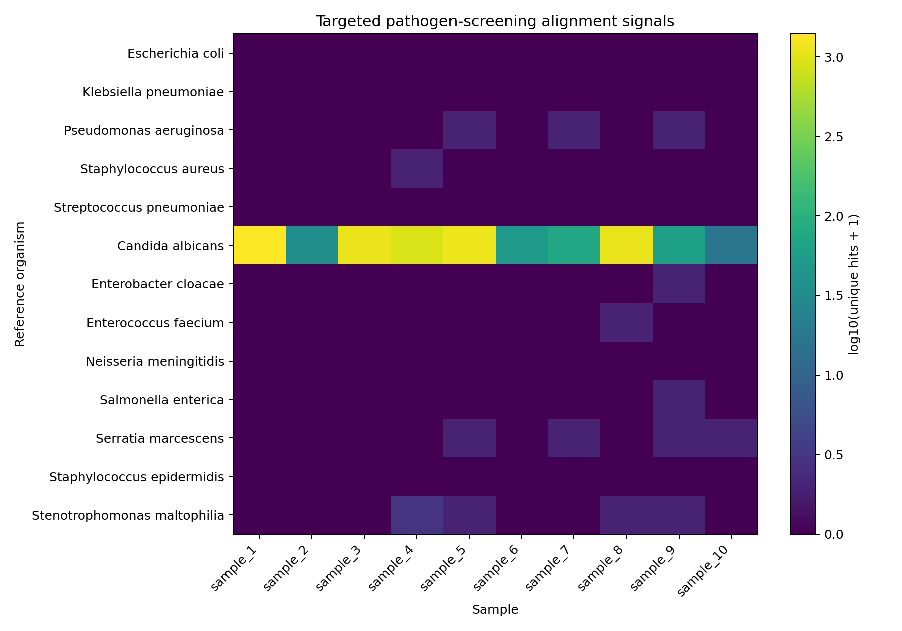

# Targeted Sepsis-Associated Pathogen Screening

A reproducible Python/BLAST workflow for screening sequencing reads against a
targeted panel of sepsis-associated pathogens and summarizing species-level
alignment signals.

> **Portfolio / educational project.** This workflow demonstrates a bioinformatics
> screening approach. Alignment counts are not a clinical diagnosis of bloodstream
> infection or sepsis.

## Project overview

This project was developed from graduate bioinformatics coursework using ten
course-provided blood-derived sequencing samples, each containing 100,000 reads.
The workflow:

1. performs basic FASTA quality-control summaries;
2. reconstructs a 13-organism reference panel from NCBI nucleotide accessions;
3. screens each sample against the panel with BLASTn;
4. maps subject accessions to organism names;
5. counts each read at most once per organism within a sample;
6. reports raw counts and hits normalized per 100,000 reads; and
7. generates compact result figures.

The public repository intentionally excludes the original raw sequencing inputs and
intermediate per-read BLAST files. See [`data/README.md`](data/README.md).

## Reference panel

The panel contains 12 bacterial species and the yeast *Candida albicans*.
Accession-level provenance is stored in
[`refs/reference_accessions.tsv`](refs/reference_accessions.tsv), and
`prepare_reference.py` retrieves the corresponding nucleotide records from NCBI.

## Workflow

```text
Authorized FASTA inputs
        |
        v
  qc_reads.py
        |
        v
prepare_reference.py ---> NCBI nucleotide references
        |
        v
run_blast_screen.py
        |
        v
summarize_hits.py
        |
        +----> pathogen_counts_by_sample.csv
        |
        +----> pathogen_hits_per_100k_reads.csv
        |
        v
plot_results.py
        |
        +----> Candida signal bar chart
        +----> pathogen-signal heatmap
```

## BLAST settings

The screening step uses nucleotide-to-nucleotide BLAST with the same core search
settings used in the original project:

- task: `blastn`
- E-value threshold: `1e-5`
- word size: `11`
- maximum target sequences per query: `5`
- tabular output fields:
  `qseqid sseqid pident length qlen evalue bitscore`

NCBI documents `-evalue` as the Expect-value threshold for saving hits and
`-outfmt 6` as tabular output with configurable fields.

## Results

The dominant signal in the archived results was *Candida albicans*. The largest
unique read-species counts were observed in:

| Sample | *Candida albicans* hits |
|---|---:|
| sample_1 | 1,395 |
| sample_3 | 1,127 |
| sample_4 | 931 |
| sample_5 | 1,149 |
| sample_8 | 1,090 |

Other organisms produced only sparse alignment signals in these data.





### Interpretation

Within this targeted panel, several samples showed substantially larger
*Candida albicans* alignment signals than the remaining samples. These counts are best
interpreted as **screening signals that warrant further validation**, not evidence of a
clinical diagnosis.

Important limitations include:

- the reference panel is targeted rather than comprehensive;
- organisms absent from the panel cannot be detected;
- short reads can align nonspecifically to conserved or low-complexity regions;
- the workflow does not perform host-read depletion;
- the workflow does not evaluate genome-wide breadth/depth of coverage;
- no contamination model or negative-control background subtraction is included; and
- no clinical or orthogonal laboratory validation is available in this portfolio dataset.

A stronger diagnostic-style workflow would add host subtraction, alignment-quality and
coverage filters, negative controls, broader taxonomic classification, and independent
validation.

## Reproducibility

### Requirements

- Python 3
- NCBI BLAST+
- Python package in `requirements.txt` for figure generation

The exact BLAST+ version used during the original coursework was not recorded; that is
a reproducibility limitation of the historical project. For new runs, record
`blastn -version` alongside the results.

### 1. Create a Python environment

```bash
python3 -m venv .venv
source .venv/bin/activate
python -m pip install -r requirements.txt
```

On Windows PowerShell, activate the environment with:

```powershell
.venv\Scripts\Activate.ps1
```

Install NCBI BLAST+ using the official NCBI installation guidance and confirm that:

```bash
blastn -version
```

works from your terminal.

### 2. Add authorized input FASTA files

Place the ten original inputs in `data/raw/` as described in
[`data/README.md`](data/README.md).

### 3. Download the reference panel

NCBI recommends including an email and tool identifier in E-utilities requests.
This script sends one batched EFetch request for the 13 accessions:

```bash
python src/prepare_reference.py --email YOUR_EMAIL@example.com
```

### 4. Run input QC

```bash
python src/qc_reads.py
```

Output:

```text
results/sample_qc.tsv
```

### 5. Run BLAST screening

```bash
python src/run_blast_screen.py
```

Intermediate per-read alignments are written to `results/blast/` and are ignored by Git.

### 6. Summarize organism-level hits

```bash
python src/summarize_hits.py
```

Outputs:

```text
results/pathogen_counts_by_sample.csv
results/pathogen_hits_per_100k_reads.csv
```

### 7. Recreate figures

```bash
python src/plot_results.py
```

## Repository contents

```text
.
├── README.md
├── .gitignore
├── requirements.txt
├── data/
│   └── README.md
├── refs/
│   └── reference_accessions.tsv
├── results/
│   ├── pathogen_counts_by_sample.csv
│   ├── pathogen_hits_per_100k_reads.csv
│   └── figures/
│       ├── candida_hits_by_sample.png
│       └── pathogen_hits_heatmap.png
└── src/
    ├── prepare_reference.py
    ├── qc_reads.py
    ├── run_blast_screen.py
    ├── summarize_hits.py
    └── plot_results.py
```

## Portfolio cleanup from the original coursework

The public version intentionally standardizes terminology and removes redundant files:

- `person_N` is presented as `sample_N` in public outputs;
- “bacteria” is replaced with “pathogen” when the panel includes *Candida albicans*;
- the BLAST threshold is described correctly as an **E-value**, not a p-value;
- all seven BLAST output fields are documented;
- the unused local-BLAST-database build step was removed because the archived analysis
  used BLAST `-subject` mode;
- species mapping is driven by an explicit accession manifest rather than fragile
  text matching in FASTA descriptions; and
- intermediate TSV/SAM/BAM files and raw sequencing reads are omitted from the
  public repository.

## References

1. NCBI. **BLAST Command Line Applications User Manual**.  
   https://www.ncbi.nlm.nih.gov/books/NBK279690/

2. NCBI. **Options common to BLAST+ search applications**.  
   https://www.ncbi.nlm.nih.gov/books/NBK279684/table/appendices.T.options_common_to_all_blast/

3. NCBI. **Entrez Programming Utilities Help: E-utilities usage guidelines and EFetch**.  
   https://www.ncbi.nlm.nih.gov/books/NBK25497/  
   https://www.ncbi.nlm.nih.gov/books/NBK25499/

4. Umemura Y, Ogura H, et al. Current spectrum of causative pathogens in sepsis:
   a prospective nationwide cohort study in Japan. *International Journal of Infectious
   Diseases*. 2021;103:343-351.  
   https://doi.org/10.1016/j.ijid.2020.11.168

5. Grumaz S, Stevens P, Grumaz C, et al. Next-generation sequencing diagnostics of
   bacteremia in septic patients. *Genome Medicine*. 2016;8:73.  
   https://doi.org/10.1186/s13073-016-0326-8

6. Duggan S, Leonhardt I, Hünniger K, Kurzai O. Host response to *Candida albicans*
   bloodstream infection and sepsis. *Virulence*. 2015;6(4):316-326.  
   https://doi.org/10.4161/21505594.2014.988096
